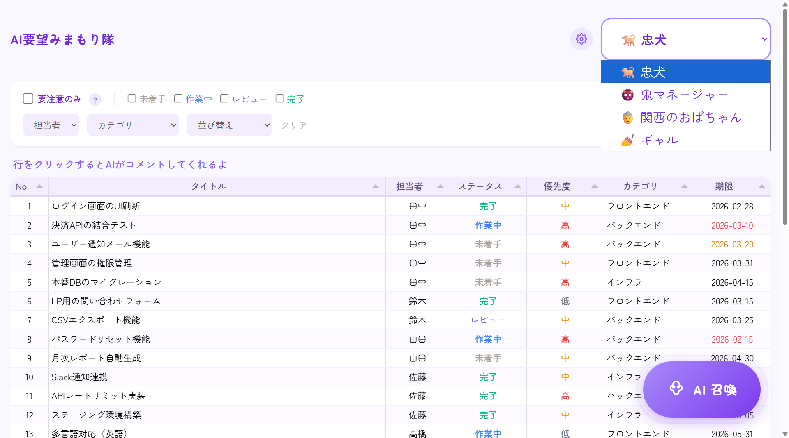
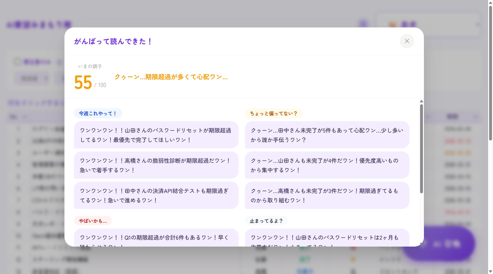
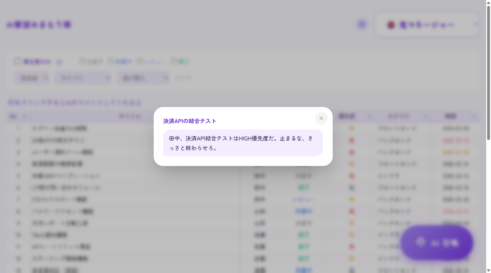
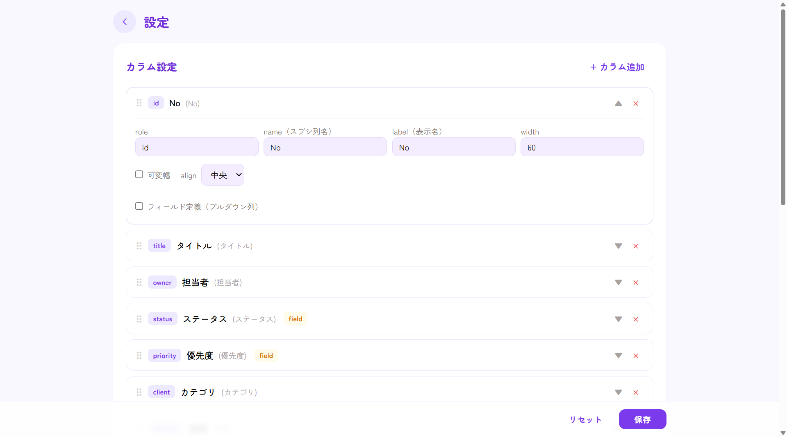
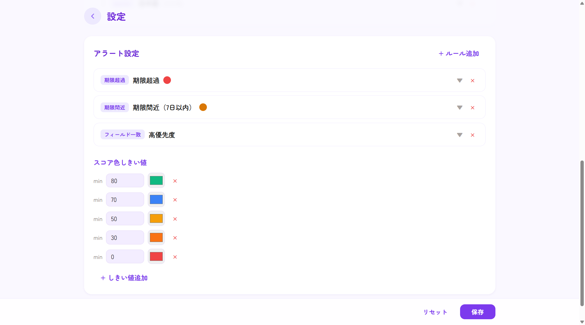

# AI要望みまもり隊

> 忠犬・鬼上司・関西のおばちゃん・ギャルが、チームの課題を見守るWebアプリ

## これは何？

「ダッシュボード作ったけど、結局誰も見ない」——スプシ運用あるある。
運用自体は壊れてない。みんな慣れてる。でも、状況を俯瞰する習慣がつかない。

**AI要望みまもり隊**は、スプシを置き換えるんじゃなくて「ちょっとしたアクセント」を加えるアプローチ。ペルソナを持ったAIキャラが、課題の進捗を見守って、キャラの口調で報告してくれる。

鬼上司に叱られたり、忠犬に心配されたり、関西のおばちゃんにツッコまれたり。
**ちょっと気になって見に行きたくなる**——それがこのアプリの狙い。

## スクリーンショット







## 4つのペルソナ

| キャラ | 口調 | こんなとき |
|---|---|---|
| 忠犬 | 「ワンワンワン！！期限過ぎてるワン！」 | 危険を全力で知らせてくれる |
| 鬼マネージャー | 「田中、認証テスト期限切れだぞ。今日中にやれ」 | 冷たく圧をかけてくる |
| 関西のおばちゃん | 「あんた何しとん！はよしぃや！」 | 愛のあるツッコミ |
| ギャル | 「てかさ、それまじでやばくない？」 | ノリは軽いけど分析はガチ |

## 機能

### AI召喚（全体サマリー）

画面右下の「AI召喚」ボタンを押すと、AIがスプシの全課題を読んで分析。5つの観点でレポートしてくれる。

- **今週これやって！** — 誰が何を動かすべきか
- **ちょっと偏ってない？** — 担当者の負荷バランス
- **やばいかも...** — リリースリスク
- **止まってるよ？** — 長期停滞の課題
- **ここ集中してない？** — 未完了が集中してるカテゴリ

100点満点のスコアと、ペルソナのひとこと感想つき。

### 行クリック（個別コメント）

テーブルの行をクリックすると、その課題1件にAIがコメント。「次に何すべきか」をキャラの口調で教えてくれる。

### フィルタ & ソート

- **要注意のみ**: 期限超過・期限間近・停滞・高優先度に絞り込み
- **ステータス / 担当者 / カテゴリ**: ドロップダウンで絞り込み
- フィルタした状態でAI召喚すると、絞り込んだ課題だけを分析

### 設定画面

歯車アイコンから設定画面へ。カラム定義・アラートルール・スコア色のしきい値をブラウザから編集できる。自分のスプシの列構成に合わせてカスタマイズ可能。

## セットアップ

### 1. Google Cloud

- サービスアカウント作成 → JSONキーをダウンロード
- Google Sheets API を有効化
- スプレッドシートにサービスアカウントのメールを「閲覧者」として共有

### 2. Gemini API

- Google AI Studio で APIキー取得

### 3. 環境変数

`.env.example` をコピーして `.env` を作成、値を埋める。

```bash
cp .env.example .env
```

| 変数 | 説明 |
|---|---|
| GOOGLE_SERVICE_ACCOUNT_KEY | サービスアカウントキーのパス（デフォルト: `./service-account.json`） |
| SPREADSHEET_ID | スプシURLの `/d/` と `/edit` の間の部分 |
| SHEET_NAME | シート名 |
| GEMINI_API_KEY | Google AI Studio で取得したAPIキー |

### 4. スプレッドシートにサンプルデータを入れる

`sample-data.csv` を Google スプレッドシートにインポートすればすぐ試せる。期限切れや負荷偏りが仕込んであるので、ペルソナが盛り上がる。

### 5. 起動

```bash
npm install
npm run dev
# http://localhost:3000
```

## 技術スタック

Node.js / Express / Google Sheets API / Gemini 2.5 Flash / Tabulator / Tailwind CSS / Zen Maru Gothic

## Author

**shumatsumonobu** — [GitHub](https://github.com/shumatsumonobu) / [X](https://x.com/shumatsumonobu) / [Facebook](https://www.facebook.com/takuya.motoshima.7)

## License

[MIT](LICENSE)
