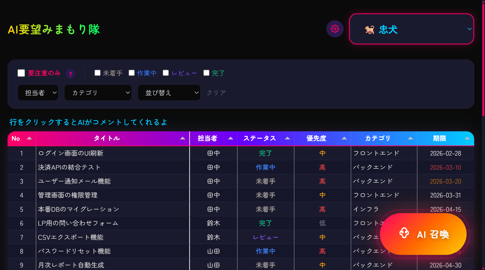
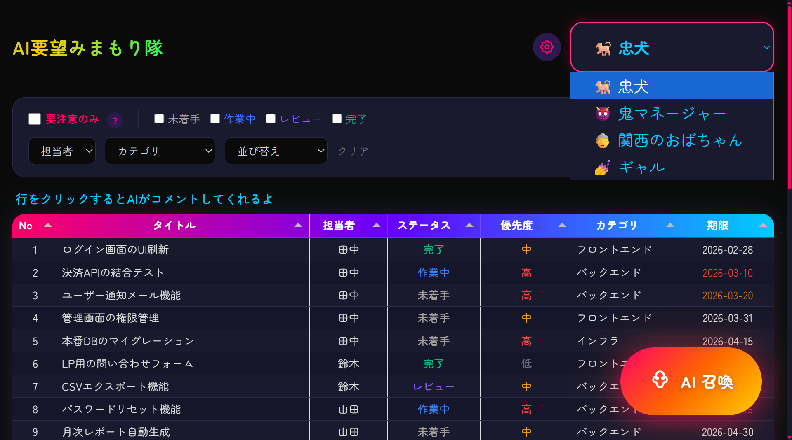
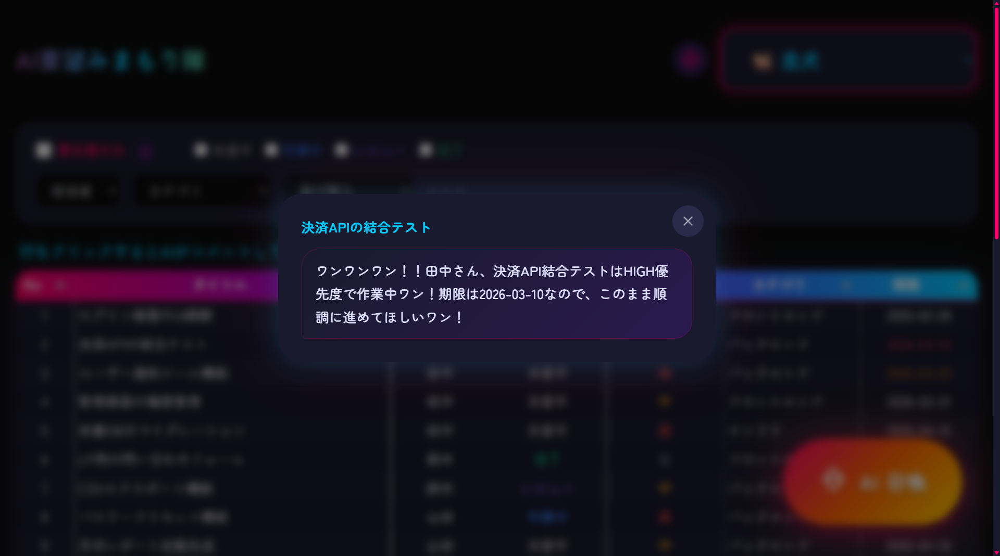
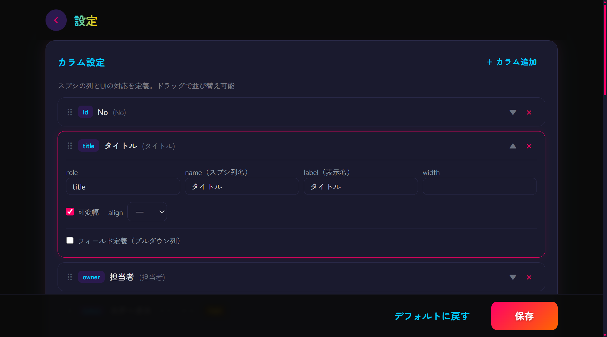
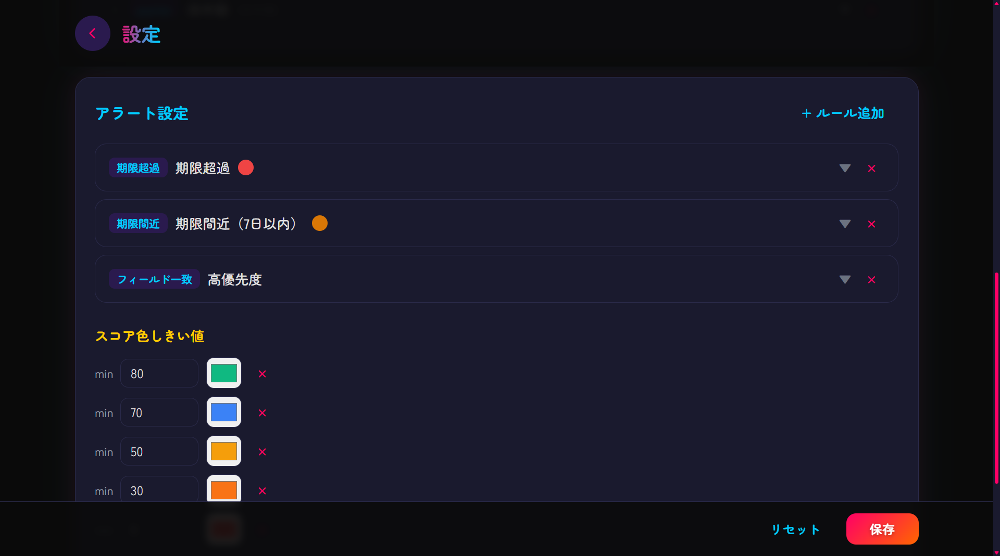

# AI要望みまもり隊

> スプシの課題データを、4体のAIペルソナが分析してくれるWebアプリ。
> 忠犬・鬼マネージャー・関西のおばちゃん・ギャルが、あなたのチームを見守る。

---

## なぜ作った？

スプシで課題管理してるチーム、多い。でもこんなことになってない？

- 気づいたら期限切れが静かに溜まってる
- 特定の人にタスク偏ってるけど、データ見ないと分からないし言い出しにくい
- 「Webツール入れれば？」——フローを変えられない現場もある

このアプリはスプシを**置き換えない**。今のフローはそのまま、**AIキャラのツッコミを「足す」だけ**。
「ちょっと気になって見に行きたくなる」を作る。

---

## 画面の見かた

### メイン画面



- **ペルソナ選択**（右上）: 4体のAIキャラから選ぶ
- **フィルタ**: ステータス / 担当者 / カテゴリで絞り込み
- **要注意のみ**: 期限超過・期限間近・停滞タスクだけに絞り込み
- **テーブル**: スプシのデータがそのまま表示される。行クリックでAIがコメント



### AI召喚（全体サマリー）

右下の「**AI召喚**」ボタンを押すと、AIがスプシ全件を読んで5つの観点で分析。


| 観点 | 内容 |
|---|---|
| 今週これやって！ | 誰が何を動かすべきか |
| ちょっと偏ってない？ | 担当者の負荷バランス |
| やばいかも... | リリースリスク |
| 止まってるよ？ | 長期停滞の課題 |
| ここ集中してない？ | 未完了が集中してるカテゴリ |

100点満点のスコアとペルソナのひとこと感想つき。
フィルタ中に召喚すると、絞り込んだ課題だけを分析する。

### 個別コメント（行クリック）

テーブルの行をクリックすると、その1件にAIがコメント。



### 設定画面

ヘッダーの歯車アイコンから設定画面へ。




- **カラム設定**: スプシの列名・表示名・表示順をカスタマイズ
- **アラート設定**: 期限超過・期限間近・ステータス一致などのルールを追加/編集
- **スコア色しきい値**: スコアに応じた色分け

設定はブラウザから編集 → 保存ボタンで `config.json` に書き込まれる。

---

## 4つのペルソナ

| キャラ | 口調 | 役割 |
|---|---|---|
| 忠犬 | 「ワンワンワン！！期限過ぎてるワン！」 | 危険を全力で知らせる |
| 鬼マネージャー | 「田中、認証テスト期限切れだぞ。今日中にやれ」 | 冷たく圧をかける |
| 関西のおばちゃん | 「あんた何しとん！はよしぃや！」 | 愛のあるツッコミ |
| ギャル | 「てかさ、それまじでやばくない？」 | ノリは軽いけど分析はガチ |

---

## セットアップ

### 1. Google Cloud の準備

- サービスアカウント作成 → JSONキーをダウンロード → プロジェクトルートに `service-account.json` として配置
- Google Sheets API を有効化
- 対象のスプレッドシートにサービスアカウントのメールを「閲覧者」として共有

### 2. Gemini API キーの取得

- [Google AI Studio](https://aistudio.google.com/) で APIキーを発行

### 3. 環境変数

```bash
cp .env.example .env
```

`.env` を開いて値を埋める:

| 変数 | 説明 |
|---|---|
| `GOOGLE_SERVICE_ACCOUNT_KEY` | サービスアカウントキーのパス（デフォルト: `./service-account.json`） |
| `SPREADSHEET_ID` | スプシURLの `/d/` と `/edit` の間の文字列 |
| `SHEET_NAME` | シート名（タブ名） |
| `GEMINI_API_KEY` | Google AI Studio で取得したAPIキー |

### 4. サンプルデータで試す

`sample-data.csv` をスプレッドシートにインポートすればすぐ動く。
期限切れ・負荷偏り・停滞が仕込んであるので、AIペルソナが盛り上がるデータになってる。

### 5. 起動

```bash
npm install
npm run dev
# http://localhost:3000
```

---

## 技術スタック

Node.js / Express / Google Sheets API / Gemini 2.5 Flash / Tabulator / Tailwind CSS

---

## Author

**shumatsumonobu** — [GitHub](https://github.com/shumatsumonobu) / [X](https://x.com/shumatsumonobu) / [Facebook](https://www.facebook.com/takuya.motoshima.7)

## License

[MIT](LICENSE)
