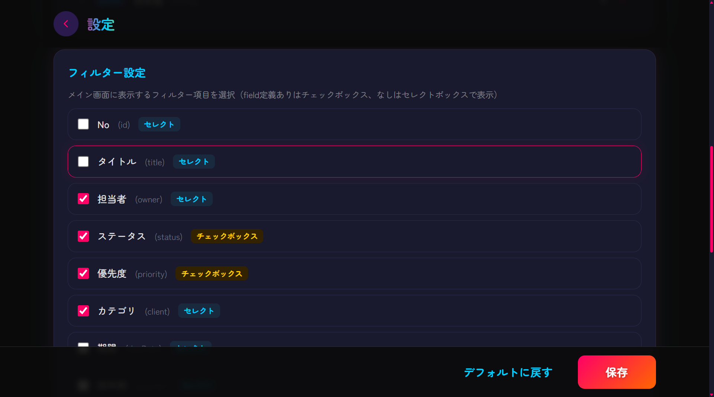
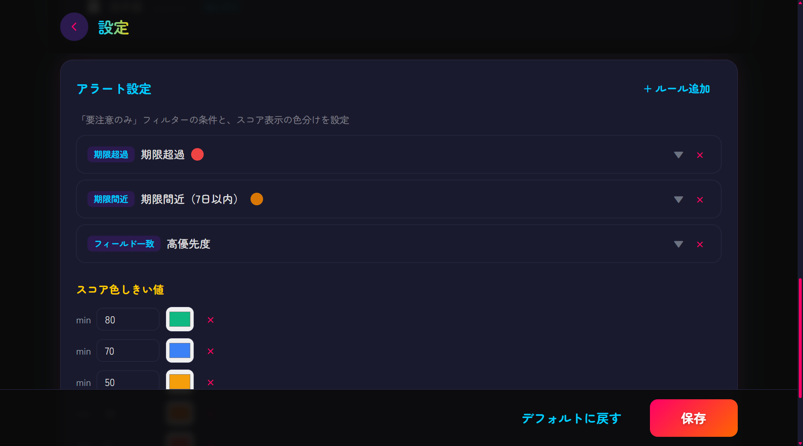

# AI要望みまもり隊

> スプシの課題データを4体のAIキャラが分析するWebアプリ
> フローを変えずに「AIのツッコミ」を足すだけ

**[LP](https://shumatsumonobu.github.io/ai-youbou-mimamoritai/)**

## なぜ作った？

スプシで課題管理してるチーム、多い。でもこうなりがち：

- 期限切れ、静かに溜まって誰も気づかない
- 特定の人にタスク集中、でも言い出しにくい
- 「Webツール入れれば？」——フロー変えられない現場もある

スプシは**そのまま**。今の運用に**AIキャラのツッコミを足すだけ**

## 画面の見かた

### メイン画面


- **ペルソナ選択**（右上）: 4体のAIキャラから選択
- **フィルタ**: ステータス・優先度・担当者・カテゴリなどで絞り込み（設定画面で項目追加可能）
- **要注意のみ**: 期限超過・期限間近・停滞タスクだけ抽出
- **テーブル**: スプシのデータをそのまま表示。行クリックでAIコメント


### AI召喚（全体サマリー）

右下の「**AI召喚**」ボタンでスプシ全件を5つの観点で分析


| 観点 | 内容 |
|---|---|
| 今週これやって！ | 誰が何を動かすべきか |
| ちょっと偏ってない？ | 担当者の負荷バランス |
| やばいかも... | リリースリスク |
| 止まってるよ？ | 長期停滞の課題 |
| ここ集中してない？ | 未完了が集中してるカテゴリ |

100点満点のスコアとペルソナのひとこと感想つき
フィルタ中の召喚で、絞り込んだ範囲だけの分析も可能

### 個別コメント（行クリック）

テーブルの行クリックで、その1件にAIがフォーカスしてコメント


### 設定画面

ヘッダーの歯車アイコンから遷移





- **カラム設定**: スプシの列名・表示名・表示順をカスタマイズ
- **フィルター設定**: メイン画面に表示するフィルター項目を選択
- **アラート設定**: 期限超過・期限間近・ステータス一致などのルールを追加/編集
- **スコア色しきい値**: スコアに応じた色分け
- **デフォルトに戻す**: 初期設定にリセット可能

ブラウザから編集 → 保存で `config.json` に反映


## 4つのペルソナ

| キャラ | 口調 | 役割 |
|---|---|---|
| 忠犬 | 「ワンワンワン！！期限過ぎてるワン！」 | 危険を全力で知らせる |
| 鬼マネージャー | 「田中、認証テスト期限切れだぞ。今日中にやれ」 | 冷たく圧をかける |
| 関西のおばちゃん | 「あんた何しとん！はよしぃや！」 | 愛のあるツッコミ |
| ギャル | 「てかさ、それまじでやばくない？」 | ノリは軽いけど分析はガチ |


## セットアップ

### 1. Google Cloud の準備

- **Sheets用**: サービスアカウント作成 → JSONキーを `service-account-sheets.json` として配置
  - Google Sheets API を有効化
  - 対象スプシにサービスアカウントのメールを「閲覧者」として共有
- **Gemini用**（2つの方法から選択）:
  - **APIキー**: [Google AI Studio](https://aistudio.google.com/) で発行
  - **サービスアカウント（Vertex AI）**: JSONキーを `service-account-gemini.json` として配置（こちらが優先）

### 2. 環境変数

```bash
cp .env.example .env
```

`.env` を開いて値を埋める

| 変数 | 説明 |
|---|---|
| `SHEETS_SERVICE_ACCOUNT_KEY` | Sheets用サービスアカウントキーのパス |
| `SPREADSHEET_ID` | スプシURLの `/d/` と `/edit` の間の文字列 |
| `SHEET_NAME` | シート名（タブ名） |
| `GEMINI_API_KEY` | Gemini APIキー |
| `GEMINI_SERVICE_ACCOUNT_KEY` | Gemini用サービスアカウントキーのパス（設定時はAPIキーより優先） |

### 3. サンプルデータで試す

`sample-data.csv` をスプレッドシートにインポートすればすぐ動く
期限切れ・負荷偏り・停滞を仕込み済み。AIペルソナが盛り上がるデータ

### 4. 起動

```bash
npm install
npm run dev
# http://localhost:3000
```


## 技術スタック

Node.js / Express / Google Sheets API / Gemini 2.5 Flash / Tabulator / Tailwind CSS


## Author

**shumatsumonobu** — [GitHub](https://github.com/shumatsumonobu) / [X](https://x.com/shumatsumonobu) / [Facebook](https://www.facebook.com/takuya.motoshima.7)

## License

[MIT](LICENSE)
